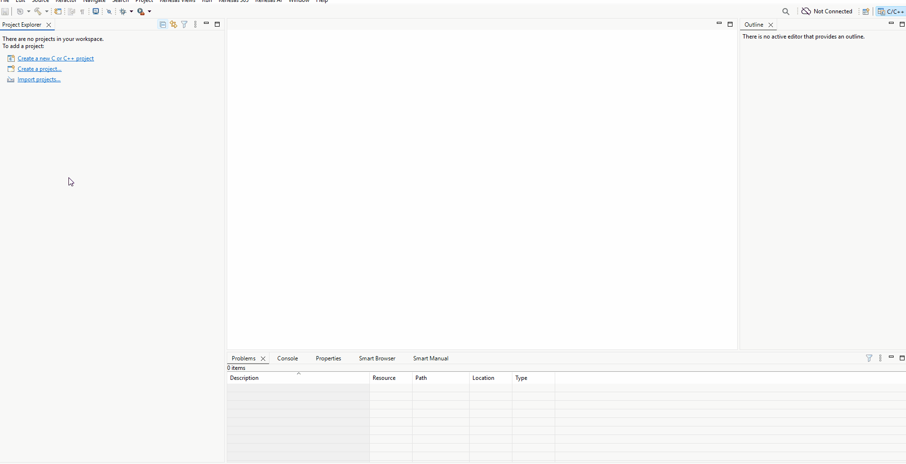
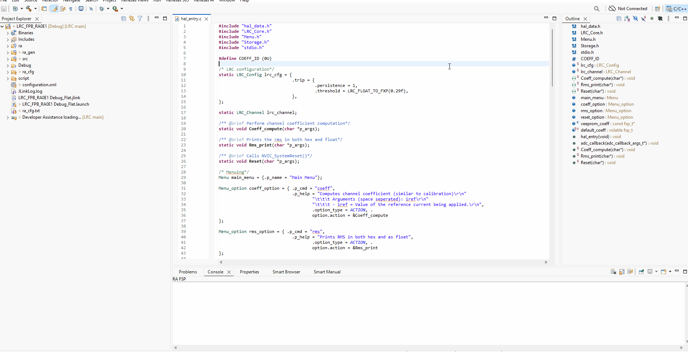
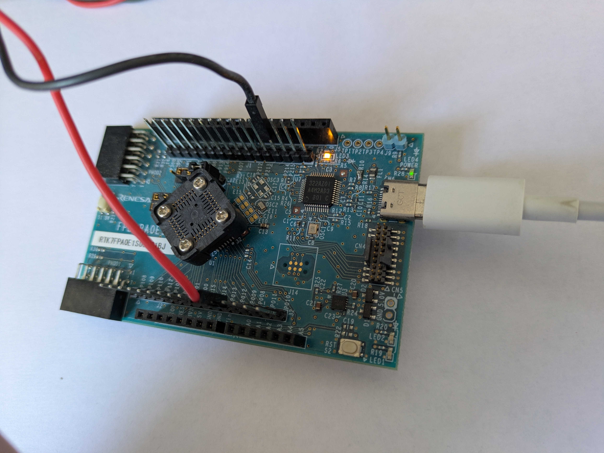
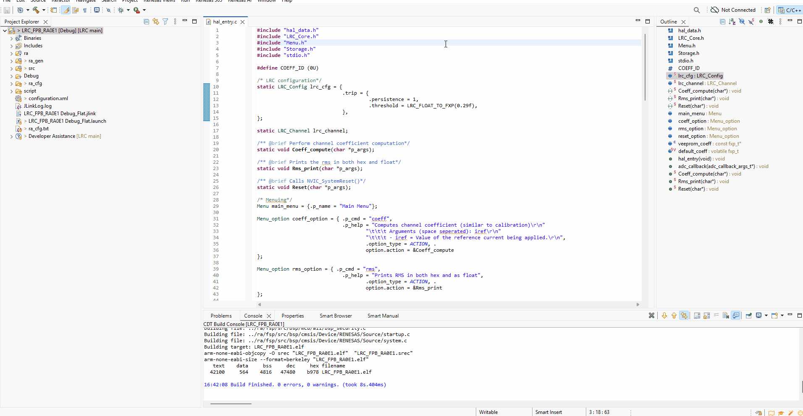
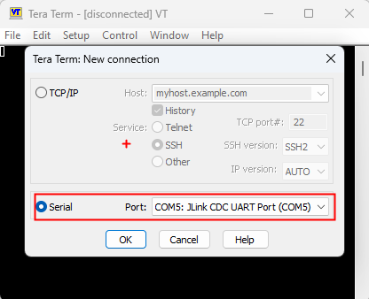
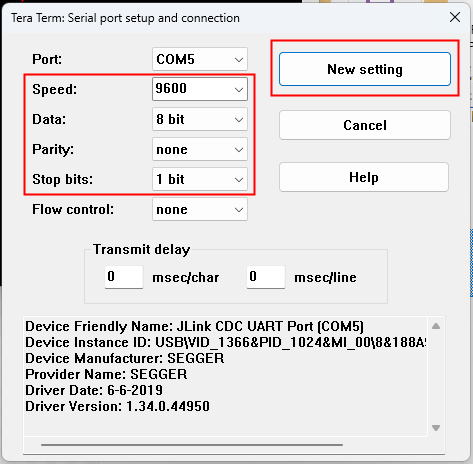
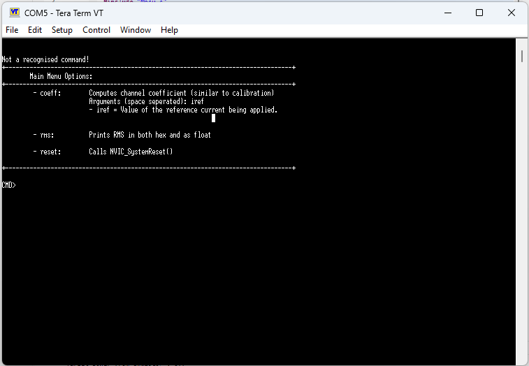
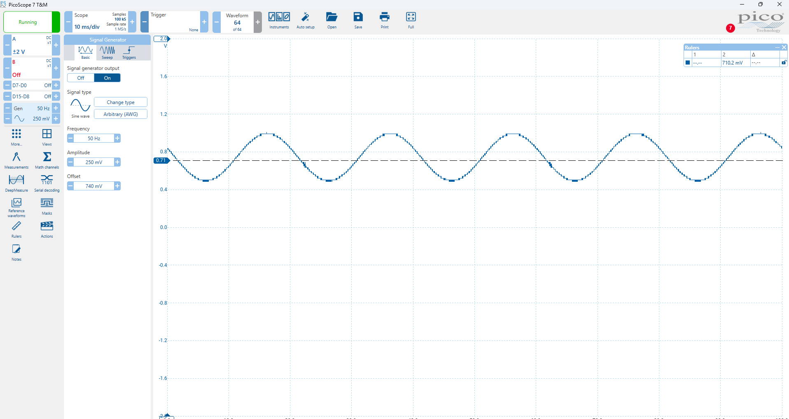
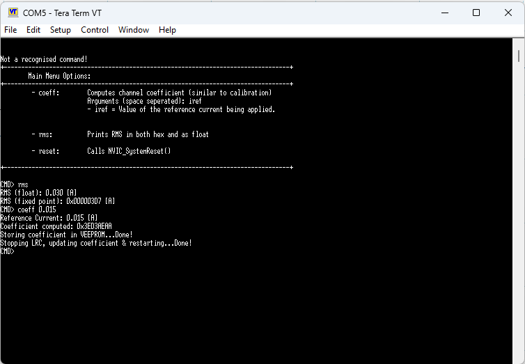

# 🛠️ FPB-RA0E1

---

## 📦 Project Overview
This project contains firmware written in C for evaluating LRC in an example application - it makes use of a serial terminal to interact with the project and uses onboard MCU headers to connect the ADC input to a signal source & an an onboard GPIO + LED to signal tripping.

---

## 🧰 Requirements

### ✅ Hardware
- Evaluation PCB: `FPB-RA0E1` (For more information e.g., User Manual/Availability/Documentation please contact your local Renesas Sales/FAE)
- Microcontroller: `RA0E1 - R7FA0E1073CFJ`
- Debugger/Programmer: `Segger J-Link OB`

### 💻 Software
- IDE: `e2 studio 2025-10+`
- FSP: `FSP 6.4.0+`
- Serial terminal: `TeraTerm or PuTTY (9600 baud, 8-N-1)`

---

## 📁 Project Structure
```
├── LRC_FPB_RA0E1/          # e2 studio project
├── imgs/                   # images for this RUNME.md
└── RUNME.md                # This file
```

---

## 🚀 Getting Started

### 1. Clone the Repository
```bash
    git clone https://github.com/lwray-renesas/LRC.git
```

### 2. Import project to e2 studio
1. Open e2 studio.
2. `File → Import → General → Existing Projects into Workspace`
3. Select `<LRC_root>/examples/FPB_RA0E1/LRC_FPB_RA0E1`.
4. Do not copy into workspace.
5. Click Finish.



### 3. Build the project

1. Right click the project
2. Build Project



### 4. Serial & Debug Connection

Now to enable the evaluation make two connections;
1. Connect to the PMOD via USB-C on CN6.
2. Connect a signal generator such that the signal is input to P012/AN004 and GND connection is made.



---

## 🧪 Testing

To run the sample application and evaluate, the following are used:
1. Teraterm to connect to the JLink CDC UART Port with settings 9600, 8-N-1
2. Signal generator to input a signal to the ADC to simulate RCD sense element

Note, the ADC uses the internal reference voltage by default so the input signal range is 0-1.48V and the application assumes a bias of 0.74V so subtracts this (2048) from every measurement to get an AC signal.

So launch the debug session and run the applcation as shown below.



Now launch TeraTerm and connect to the serial port "JLink CDC UART Port" & make the settings 9600, 8-N-1.





Now hit [Enter] and the menu will appear:



The system is successfully running.

Next apply your signal with the signal generator, here's an example signal I have set.



And you can use the commands to read the computed RMS, or recalibrate the coefficient for computing the RMS based on the current signal!



And the calibration is stored in dataflash for the next run!

---
