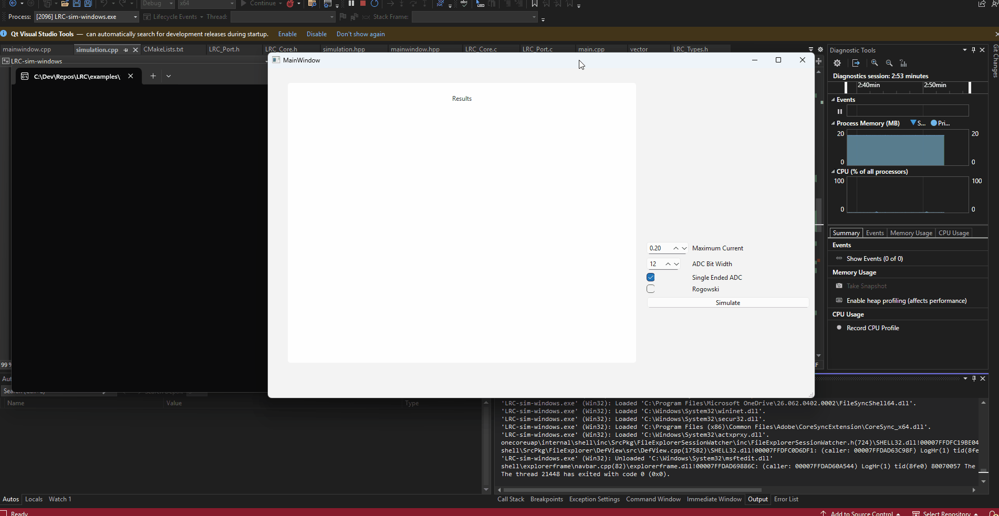

# 🛠️ PC Application

---

## 📦 Project Overview
This project contains a Qt6-based desktop application built using CMake.

It demonstrates LRC running on a PC environment and allows simulation of the mathematics and functions.

---

## 🧰 Requirements

### ✅ Software
- CMake: >= 3.28
- Qt6: Must include the following modules:
  - Qt::Widgets
  - Qt::Gui
  - Qt::Concurrent
  - Qt::Charts
- Build Environment: Visual Studio 17 2022 (or equivalent CMake-compatible IDE)

---

## 🚀 Getting Started

### 1. Clone the Repository
```bash
    git clone https://github.com/lwray-renesas/LRC.git
```

### 2. Configure the Project with CMake

1. Open CMake GUI or use CLI.
2. Set the source directory to the root of the project.
3. Set the build directory (e.g., build/).
4. Click Configure and select your generator (e.g., Visual Studio 17 2022).
5. Click Generate.

### 3. Open the Generated Project

- Open the generated solution/project file in your IDE (e.g., Visual Studio).
- Ensure Qt paths are correctly set if not auto-detected.

### 4. Build the Application

- Build the project using your IDE or run:

      cmake --build build/

### 5. Run & Debug
The simulation occurs in two parts.

#### 5.1 Signal Generation
First we use a signal generator to create a waveform for us to test the RCD code & settings.

This is the signal generator suited to this project: [Signal-Generator](https://github.com/Forman1998/Signal-Generator).

Follow the instructions available at the repository to generator the approriate data JSON file for the next step!


#### 5.2 Simulation

- Launch the application from your IDE or run the compiled binary from the build directory.
- Use breakpoints and IDE tools to debug as needed.

To run the simulation, click the "Simulate" button & open the JSON file generated in the previous step.

The simulation will run and will display the raw signal + the computed RMS & trip point, therefore allowing comprehensive testing and debug of the RCD code behaviour.



---

